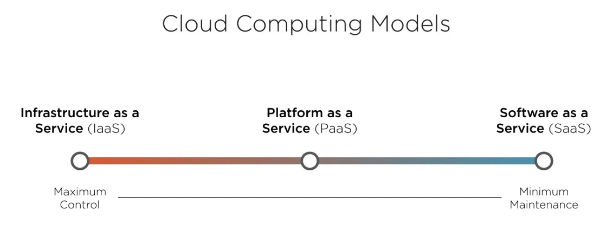

### Cloud Deployments and AWS (Amazon Web Services) Core services

 

☁️👨‍💻

---

> **NOTE:** Check core services section for a brief info of the pertaining AWS service

#### What are you architecting for?

###### Categories:
1. Lift & shift  
> Third-party software; one just needs to deploy it
2. Modernization  
> Leverage some components like database on the cloud
3. Extension of on-prem  
> New component to be served on the cloud that interacts with an on-prem setup through APIs
4. Green-field  
> A completely new software from the ground up

###### IaaS vs PaaS vs SaaS?

###### DevOps

1. CI/CD
2. Monitoring and logging
3. Configuration management
> Puppet/chef, software, OS upgrades

#### Sample steps to follow for IaaS

##### infra

1. Use CloudFormation designer tool and deploy necessary services
2. Use OpsWorks for configuration management
3. Configure monitoring and a centralized logging solution
> Can use third-party, open source or CloudWatch for that

##### deployment

1. Create an EC2 AutoScaling resource group for HA
> Auto scaling can be configured based on these parameters:
> - Average CPU % utilization 
> - Average network in
> - Average network out
> - Load balancer requests per target
> Policies should also be configured properly. When to scale out and scale in. Performance testing is critical
2. Configure an HTTPS/HTTP/TCP load balancer and put it in front of this setup (AWS ELB)
3. Global Accelerator configuration
> Based on the resources one has allocated in availability zones
4. Allocate an elastic IP and integrate it with Route 53

## AWS Core services

#### 1. Interacting with AWS

1. Web console
2. CLI
> Access keys required. Root user keys can also be retrieved but IAM user with limited permissions is recommended.
3. AWS SDK for automation
> All major languages are supported

#### 2. Compute Services

Leverage cloud-based virtual machines for workloads.

1. EC2*
> Secure and resizable virtual servers
> Generally used in autoscaling resource groups
2. Elastic Beanstalk
> Scaling and deploying web apps and services
3. AWS Lambda
> Compute without managing servers. "Serverless".
4. Step functions
> Orchestration of workflows through a fully managed service. Can integrate with Lambda, DynamoDB, Data processing services and ML services just to name a few. 

It's advised that one creates related services into a single resource group for isolation and easier management.

##### 2A. EC2 concepts

1. Instance types  
> General purpose, Memory optimized, storage optimized, Accelerated computing  
> eg. t3.medium, m5.large, c5d.24xlarge, p3.16xlarge
2. Root disk type  
> Two types: 1. Instance store (ephemeral store) | 2. Elastic Block Storage: EBS (Persistant storage)
3. Amazon Machine Image (AMI)  
> There's a marketplace to select an AMI or an org can have a custom AMI
4. Purchase options  
> Out of scope of this article, one needs to have a complete idea about the workload that will be scheduled on these EC2 instances.

While launcing, we can provide commands to run during boot process, server tags to locate it properly. Security related configs can be applied as well, who all can access the instance, what type of connections to be allowed, etc

##### 2B. Elastic Beanstalk concepts

> Automates the process of deploying and scaling workloads on EC2 (PaaS). We only pay for the services we use

What Elastic Beanstalk has over EC2?  
1. Monitoring 
2. Scaling 
3. Deployment 
4. Customization

It's app specific instead of server specific.

##### 2C. AWS Lambda

> Primary service for serverless architecture

1. Enables event-driven workflows
2. Enables running code without provisioning infrastructure
3. Charged for usage based on execution time
4. Reduced maintainance requirements, AWS does that for you
5. Scales based on demand

#### Networking and Content Delivery Services

1. VPC: Virtual Private Cloud* and Direct Connect
> **VPC:** Can configure private (NAT) and public subnets. Can peer with other VPCs  
> **Direct Connect:** dedicated network connection from own data center to AWS
2. DNS with Route 53*
> Global, Highly Available with failover DNS
> One can configure internet facing infrastructure as well as the intranet
3. ELB: Elastic Load Balancing* and scaling
> AWS offers both HTTP/HTTPS and TCP load balacing
> Integrates with EC2, ECS and Lambda
> Everything is customizable including healthchecks, ports, connection scheme, etc. Kind of like NGINX plus
4. CloudFront and API Gateway
> **CloudFront:** CDNs with edge locations, closest servers, static and dynamic content can be served
> **API Gateway:** Fully managed API management service. Directly integrates with multiple AWS services, leverages CloudFront.
5. Global Accelerator
> Routes traffic through AWS internal network. Similar to CloudFront but needs static IP addresses to serve content.
> Can be also placed in front of ELB instances load balancing their own availability zones. Multiple resource groups/IPs can be targetted
> I can configure say, 80% of the traffic to go in AZ and 20% in other

#### File storage services

1. S3*
> Stores files as objects in `buckets`. Different storage classes for different use cases. URL access possible so it's possible to serve static websites.
> Configurable rules for data lifecycle: data objects inside buckets can be transitioned into different storage class based on time, similar thing with object deletion. Use _S3 transfer acceleration_ for quick uploads using CloudFront.
2. S3 Glacier and Glacier Deep
> Archiving data within S3 as a separate storage class. Configurable retrieval times.
3. EBS (Elastic Block Store)
> Persistant block storage for EC2 instances. Allows snapshoting. Multiple volume types: SSD, IOPS SSD, HDD, Throughput optimized HDD
4. Elastic File System
> NFS file system. Configurable data lifecycle rules. Multiple availability zones supported.
5. AWS Snowball | Snowmobile
> Physical devices for data transfer. Snowmobile is an extreme version of Snowball. AWS provides the device, end-users upload their data into this device and then data is uploaded onto S3.

#### Databases and utilities

###### IaaS
1. Launch a database on EC2 for complete control

###### PaaS
2. Relational Database Service (RDS)
> MySQL, Postgres, MariaDB, AWS Aurora
> Provisioning, patching, backing and recovery
> Launches into a VPC
> DMS: Data Migration Service to onboard on-prem DB onto RDS

###### SaaS
3. DynamoDB
> NoSQL. Provides both key-value and document database. Elastic as per scale.
> In-memory cache also supported 
4. ElastiCache and Redshift
> **ElasticCache:** In-memory data stores. Supports both memcached and Redis. DB layer caching and Session storage can be done.
> **Redshift:** Data warehousing. High-performance disks and columnar storage. Isolation with VPC.

#### Management and governance services

1. CloudTrail
> Log, monitor and retain account activity. auditlog, basically. Inserts this trail in S3 or CloudWatch logs.
2. Tracking with CloudWatch* and Config
> **CloudWatch:** Metrics, logs and alarms. (just like Grafana)
> **Config:** continuously checks if the infrastructure is tweaked from its desired state
3. Systems Manager
> UI for ops data. Automate operational tasks through this.
4. CloudFormation
> Infrastructure as a Code: Provisions infrastructure (EC2 instances, S3, lambda, etc) based on declarative templates, if the stack is same.
> Comes with a drag-n-drop desginer tool to diagrammatically create the whole infrastructure
5. OpsWorks
> Managed instances of *Chef* and *Puppet*
6. Organizations and Control Tower
> **Organizations:** Account management, consolidated billing, auditing, etc
> **Control Tower:** Create user accounts with templates
